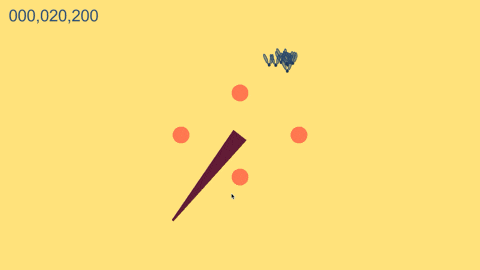

# Tongy

[🕹️ Can be played here 🕹️](https://lombardidelavega.itch.io/tongy)

A quick vertical slice prototype (2019) of a touch-based shooter where you control a character's extendable tongue to catch targets.  
Designed for mobile touch screens, this early concept explores simple yet satisfying gameplay mechanics.

## Controls

- Hold left click: Aim
- Release click: Shoot the tongue
- Shot power depends on the distance between the starting point and the aiming point

